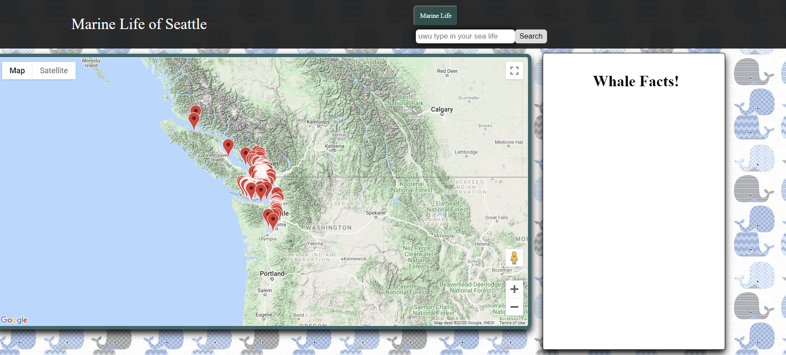
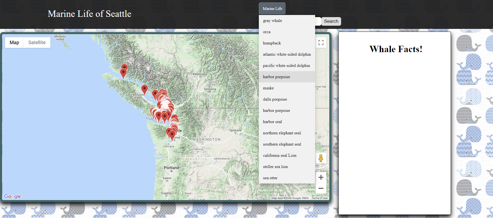
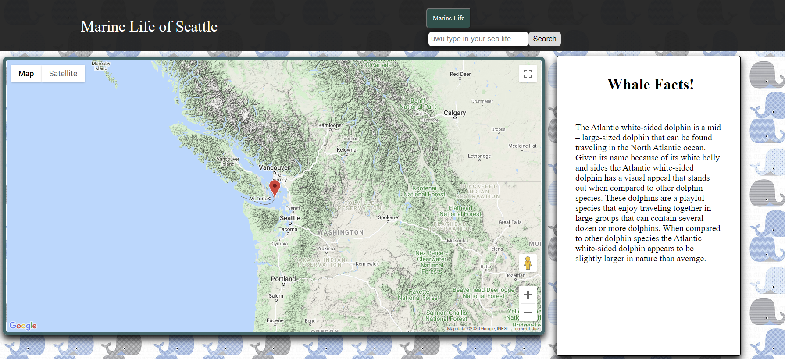

# Whale_Tracker
A web-based/mobile ready application that helps a user explore there desire to learn about whales 

Repo: https://github.com/PrLamkin/Whale_Tracker
Deployed: https://prlamkin.github.io/Whale_Tracker/

Hello everyone! welcome to this week's "How does this shit work?!" and this week, i'll be talking about our piece of tech called whale tracker

Step one: Load up the page 

Step two: click one a species that you want to know about

Step three: Profit?????

No installion required! just plug the link in and go!

Credits:
I would like to thank <a href="https://github.com/samergain" target="_target">Samer</a> and <a href="https://github.com/jordan763" target="_target">Jordan</a> from the bottom of my heart. I had a really great time working on this project with them and felt like we all worked well with one another.